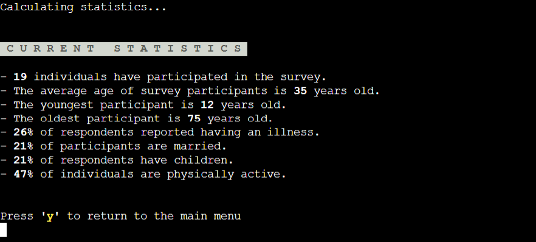

# Panem Survey

Welcome to the Panem national population survey. This survey is designed to obtain information about the fictional population of Panem as seen in the books and films: The Hunger Games. The motivation for users to submit information is that they will have less of a chance to be chosen for the annual Hunger Games. 
In addition to the survey form, this terminal also contains a section where users can view the statistics based on current submissions. 

# Table of Contents
- [Panem Survey](#panem-survey)
- [Table of Contents](#table-of-contents)
  - [Demo](#demo)
    - [A live demo to the website can be found here](#a-live-demo-to-the-website-can-be-found-here)
  - [UX](#ux)
  - [User stories](#user-stories)
    - [Strategy](#strategy)
    - [Scope](#scope)
    - [Design](#design)
  - [Technologies](#technologies)
  - [Features](#features)
    - [Existing Features](#existing-features)
    - [Features Left to Implement](#features-left-to-implement)
  - [Testing](#testing)
    - [Validator Testing](#validator-testing)
    - [Python](#python)
      - [Fixed Bugs](#fixed-bugs)
      - [Unfixed Bugs](#unfixed-bugs)
  - [Deployment](#deployment)
  - [Credits](#credits)
    - [Content](#content)

## Demo

### A live demo to the website can be found [here](https://panem-survey-5c43aa3c8dea.herokuapp.com/)

## UX
This website is targeting the whole population of Panem.
The site is focused on simplicity and ease of navigation so users can interact with the survey as easily as possible. 

## User stories
As the sole developer of this website, my goal is to create a survey on behalf of the government that is accessible to a wide range of users and collects the data in an external document for later reference. 
I came up with the following points, which are applicable to the users:

- As a user, I want to understand the purpose of this website quickly and easily.
- As a user, I want to easily navigate this website.
- As a user, I want to understand how to input my answers to the survey.
- As a user, I want the questions in the survey to be easy to understand.
- As a user, I want to see the statistics related to the survey.
- As a user, I want to know what is valid and not valid for each question.
- As a user, I want to be able to exit the quiz at the end of my submission.

### Strategy
The goal is to create an interactive online survey that reaches the populaton of Panem and is accessible to a wide range of users. 

### Scope
For the users, I wanted to build an interactive survey that is engaging to users and encourages submission to maximise the accuracy of the opoulation statistics. 

### Design
Due to this program being built for terminal use, there was not a design input. 

## Technologies

1. Lucid Charts 
2. Python
3. Heroku

## Features

### Existing Features

* Start section

The start section is the "landing page" of the survey. The user is met with a welcome message intorducing them to the survey. The user is then provided a choice as to whether they would like to start the survey or view the statistics. The terminal requires the user input "a" or "b" depending on their choice. 

* Survey information

If the user inputs "a" to the terminal at the start section the survey information section will display. This section informs users how to submit their data to the survey and provides more information about the benefits and use of the survey. The terminal then prompts the user to input "y" to continue or "n" to return to the start section.

* Survey content

The terminal prints the survey questions one at a time, each requires a response from the user to continue to the next. The survey responses are validated after each input to ensure the correct values have been used by the user. If the incorrect values have been used the terminal will print the error and provide the question again. 

* Survey completion page

Once all the questions have been submitted in line with the validator, a message will print to the terminal informing the survey is complete and their answers have been submitted. The user answers are sent to a Google worksheet to be recorded. The user is then automatically returned back to the start section where the initial start message will display. 

* Statistics section 

If the user inputs "b" at the start section they will be directed to the statistics. A prompt will print to the console inforing the user the statistics are being calculated. The program fetches the values submitted to the Google worksheet and calculates statsitstics based on the Python logic. The statsitics are then printed to the console. The user will then be prompted to input "y" to return to the start section.

### Features Left to Implement

In the future I would like to add,

*   Custom styling to the webpage around the terminal to reflect the survey.

## Testing

| Section Tested | Input To Validate | Expected Outcome | Actual Outcome | Pass/Fail |
| -------------- | ----------------- | ---------------- | -------------- | --------- |
| Start section | 1 | Invalid choice. Please try again. | As expected | Pass |
| Start section | a | Moves to survey section | As expected | Pass |
| Start section | b | Moves to statistics section | As expected | Pass |
| Survey introduction | 1 | Entry not valid message appear | As expected | Pass |
| Survey introduction | y | Entry not valid message appear | As expected | Pass |
| Survey introduction | n | Invalid choice. Please try again. | As expected | Pass |
| Survey question 1 | Empty string or integer | Invalid choice. Please try again. | As expected | Pass |
| Survey question 2 | Anything other than an integer | Invalid choice. Please try again. | As expected | Pass |
| Survey question 3 | Integer above 13 or string | Invalid choice. Please try again. | As expected | Pass |
| Survey question 4 | Anything other than a string | Invalid choice. Please try again. | As expected | Pass |
| Survey question 5 | Anything other than "y" or "n" | Invalid choice. Please try again. | As expected | Pass |
| Survey question 6 | Anything other than "y" or "n" | Invalid choice. Please try again. | As expected | Pass |
| Survey question 7 | Anything other than "y" or "n" | Invalid choice. Please try again. | As expected | Pass |
| Survey question 8 | 7 | Invalid choice. Please try again. | As expected | Pass |
| Survey question 9 | A string or an integer above 10 or below 1 | Invalid choice. Please try again. | As expected | Pass |
| Survey question 10 | 7 | Invalid choice. Please try again. | As expected | Pass |
| Survey question 11 | Anything other than "y" or "n" | Invalid choice. Please try again. | As expected | Pass |
| Survey completion | N/A | Returns user to the start section | As expected | Pass |
| Statistics section | Anything other than "y" | Returns user to start section | As expected | Pass |

### Validator Testing

### Python

I validated my files using Code Institute's Python Linter.
No errors or warnings were found when passing though the linter.

#### Fixed Bugs

| **Bug** | **Fix** |
| --- | --- |
| TypeError was occuring when the validator was run | Removed calling the validator function outside |
| Statistics were being calculated and not rounded correctly | inserted the round() function into the print |
| Validator for the statistics was accepting values other than "y" | Amended validation to use while loop to check for input |
| Text for the survey introduction was too long for the console | Added \n so the text can be wrapped in a readable way |
| Terminal was clearing before the messages written above the command were displayed | Added a time delay to the terminal clear code using the time.sleep() function | 
| The timesleep() and os.system() functions weren't working | I had to import these at the top of my code |

#### Unfixed Bugs

None 

## Deployment

### Version Control

- I used CodeAnywhere to create my site and pushed to GitHub to the remote repository panem_survey.

The following git commands were used throughout development to push code to the remote repo:

- git add <file> - This command was used to add the file(s) to the staging area before they are committed.

- git commit -m “commit message” - This command was used to commit changes to the local repository queue ready for the final step.

- git push - This command was used to push all committed code to the remote repository on github.

### Heroku Deployment

- Heroku provides a platform for hosting web applications, including those built using Python. I deployed my Python-based survey on Heroku, making it accessible to users.
  
- The deployed site will update automatically upon new commits to the master branch.

## Credits

### Content

* I got the code for clearing the terminal from [stack overflow](https://stackoverflow.com/questions/2084508/clear-terminal-in-python)
* I got the code for delaying the clearing of the console from [pierian training](https://pieriantraining.com/adding-delay-in-python-a-beginners-guide/#:~:text=Python%20provides%20a%20built%2Din,a%20specified%20number%20of%20seconds.)